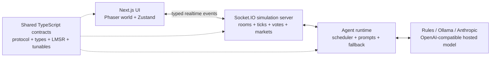

# Love AIsland

An AI-driven social-strategy game where autonomous contestants make friends, form voting blocs, betray allies, and fight to become the last islander standing—while human spectators trade on the outcome in a live prediction market.

Love AIsland combines a realtime multiplayer game, a pixel-art simulation, an agent swarm, and LMSR prediction markets. Contestants act from their own personalities, memories, relationships, and private plans instead of following a fixed script.

## Demo

▶ **[Watch the full 1:53 gameplay walkthrough](./demo/love-aisland-12-agent-walkthrough.mp4)**

The video follows a complete 12-agent game: creation, betting, conversations, relationship changes, an alliance, compulsory voting events, vote-off departures, sudden-death fights, and the final winner.

## What the project does

Each contestant is an independent agent with a personality, memories, relationships, private plans, and a changing read of the game. Agents move around a shared island and decide whom to approach, what to say, which information to share, who feels threatening, and which relationships are worth protecting.

The simulation turns those decisions into a live social game:

- **Emergent conversations:** agents joke, argue, reassure one another, campaign, and quietly test voting plans.
- **Persistent relationships:** trust, affinity, and threat change after conversations, witnessed events, betrayals, and joint decisions.
- **Alliances and strategy:** agents form blocs, count support, conceal targets, deflect danger, and change plans when the numbers are weak.
- **Formal voting:** living contestants cast ballots during voting events, with results and tallies surfaced in the island feed.
- **Realtime spectator play:** people join by room code or QR, receive tokens, inspect contestants, and follow the action as it unfolds.
- **Prediction markets:** every contestant has a live Yes/No LMSR market whose price reacts to bets and observable game events.
- **A complete ending:** eliminations, combat, and market settlement continue until one contestant wins.
- **Resilient AI:** cloud, local, hosted, and deterministic rule backends share one interface, so a failed model never has to stop the game.

## How a game unfolds

1. **Create or join an island.** Rooms have their own cast, configuration, spectators, markets, and lifecycle.
2. **Build the cast.** Seed autonomous contestants for a simulation or invite players through a room code or QR link.
3. **Watch the social game develop.** Contestants move, talk, remember outcomes, overhear information, and build alliances.
4. **Survive events and votes.** Agents campaign before ceremonies and commit to real ballots when voting begins.
5. **Play the market.** Spectators buy Yes or No shares, track their portfolios, and follow the contestants they backed.
6. **Reach the finale.** The server resolves every elimination in order, settles the winner's market, and publishes the final leaderboard.

## Tech stack

| Layer              | Technology                                                               | Role                                                                                         |
| ------------------ | ------------------------------------------------------------------------ | -------------------------------------------------------------------------------------------- |
| Web application    | Next.js 16, React 19, TypeScript                                         | App Router UI, onboarding, room creation, markets, admin tools, and results                  |
| Island renderer    | Phaser 3                                                                 | Pixel-art world, movement, conversations, camera control, fights, and elimination animations |
| Client state       | Zustand                                                                  | Live room state, conversations, positions, feed history, and selected contestants            |
| Realtime transport | Socket.IO                                                                | Typed snapshots, tick diffs, speech, events, votes, market updates, and room commands        |
| Styling and UI     | Tailwind CSS 4, shadcn, Base UI, Lucide                                  | Responsive controls, panels, overlays, and visual system                                     |
| Simulation server  | Node.js 22, TypeScript                                                   | Authoritative multi-room lifecycle, movement, social logic, events, markets, and combat      |
| Agent runtime      | Custom `@arena/swarm` package                                            | Scheduling, prompting, decisions, call budgets, circuit breaking, and backend fallback       |
| Model backends     | Anthropic SDK, Ollama, OpenAI-compatible HTTP, deterministic rules       | Cloud, local, hosted, or offline contestant intelligence                                     |
| Prediction markets | Custom LMSR implementation                                               | Yes/No pricing, shares, event-driven drift, settlement, and spectator portfolios             |
| Shared contracts   | `@arena/shared`                                                          | Socket protocol, domain types, tunables, relationships, feed events, and market math         |
| Tooling            | pnpm workspaces, TypeScript project references, ESLint, Node test runner | Monorepo development, static checks, and automated tests                                     |

The game is intentionally lightweight operationally: active room state lives in the authoritative server process, and collected join contacts use an operator-protected JSONL file rather than requiring a database.

## Architecture



The server owns the truth. Browsers send commands and receive an initial snapshot followed by small realtime diffs. The swarm produces contestant intents and dialogue, while the server validates and resolves movement, conversations, alliances, ballots, eliminations, market settlement, and the winner.

## Repository structure

```text
apps/
  web/       Next.js application and Phaser game client
  server/    Socket.IO simulation server and authoritative game state
packages/
  shared/    Domain types, protocol, tunables, relationships, feed, and LMSR math
  swarm/     Agent scheduler, prompts, model backends, and deterministic fallback
docs/        Architecture, data-model, task-graph, and operator documentation
deploy/      Deployment configuration and runbook
demo/        Gameplay walkthrough
```

## Quick start

### Requirements

- Node.js 22 or newer
- pnpm 11

### Install and run

```bash
pnpm install
pnpm dev
```

This starts:

- Web app: [http://localhost:3000](http://localhost:3000)
- Realtime server: `http://localhost:4000`
- Health check: [http://localhost:4000/healthz](http://localhost:4000/healthz)

No model key is required. The deterministic rule backend can run a complete game offline.

## Development commands

| Command                          | Purpose                               |
| -------------------------------- | ------------------------------------- |
| `pnpm dev`                       | Start the web app and server together |
| `pnpm dev:web`                   | Start only the Next.js app            |
| `pnpm dev:server`                | Start only the simulation server      |
| `pnpm test`                      | Run every workspace test suite        |
| `pnpm typecheck`                 | Type-check the full monorepo          |
| `pnpm --filter @arena/web lint`  | Lint the web application              |
| `pnpm --filter @arena/web build` | Build the production web bundle       |

## Model backends

Every model call passes through one backend seam configured with `SWARM_*`. A rule engine sits underneath the selected backend as an automatic fallback, so a failed or rate-limited model never stalls the simulation.

### Deterministic rule engine

```bash
SWARM_BACKEND=rules DEV_SEED=12 pnpm dev:server
```

### Local model with Ollama

```bash
ollama pull llama3.2
SWARM_BACKEND=local pnpm dev:server

# Pin a different installed model
SWARM_BACKEND=local SWARM_LOCAL_MODEL=gemma3:4b pnpm dev:server
```

### Anthropic

```bash
SWARM_BACKEND=anthropic \
ANTHROPIC_API_KEY=sk-ant-... \
pnpm dev:server
```

### OpenAI-compatible hosted model

```bash
SWARM_BACKEND=hosted \
SWARM_HOSTED_BASE_URL=https://api.groq.com/openai/v1 \
SWARM_HOSTED_MODEL=llama-3.3-70b-versatile \
SWARM_HOSTED_API_KEY=... \
pnpm dev:server
```

If the primary backend repeatedly fails, a circuit breaker opens and subsequent turns immediately degrade to the rule engine. Check the server boot log to confirm which backend is active.

## Configuration

[`.env.example`](./.env.example) documents every supported variable and its default. Common settings include:

| Variable                 | Purpose                                                               |
| ------------------------ | --------------------------------------------------------------------- |
| `PORT`                   | Server port; defaults to `4000`                                       |
| `CORS_ORIGINS`           | Comma-separated production origin allowlist                           |
| `NEXT_PUBLIC_SOCKET_URL` | Browser-visible Socket.IO server URL                                  |
| `NEXT_PUBLIC_APP_URL`    | Public or LAN web origin used in QR links                             |
| `OPERATOR_KEY`           | Protects operator commands and contact export; required in production |
| `DEV_SEED`               | Seeds the main room with house contestants for development            |
| `ISLAND_MAP_PATH`        | Overrides the deployed walkable-map JSON                              |
| `CONTACTS_FILE`          | JSONL path for collected join contacts                                |

### Behavior flags

`ISLAND_BEHAVIOR_ALL` is the master switch and defaults to on. Individual flags can override it in either direction.

| Area                        | Representative flags                                                                        |
| --------------------------- | ------------------------------------------------------------------------------------------- |
| Conversation and voice      | `ISLAND_CONVERSATION_VARIETY`, `ISLAND_STRIP_DASHES`, `ISLAND_CALM_CONVERSATIONS`           |
| Voting strategy             | `ISLAND_VOTE_REASONING`, `ISLAND_VOTE_DEFLECTION`, `ISLAND_VOTE_RESOLUTION`                 |
| Relationships and alliances | `ISLAND_RELATIONSHIP_MEMORY`, `ISLAND_MULTI_ALLIANCES`, `ISLAND_ALLIANCE_DEFECTION`         |
| Awareness and gossip        | `ISLAND_WORLD_AWARENESS`, `ISLAND_SPATIAL_AWARENESS`, `ISLAND_OVERHEARING`, `ISLAND_GOSSIP` |
| Spectator experience        | `ISLAND_MARKET_EVENT_DRIFT`, `ISLAND_FOLLOW_CAMERA`, `ISLAND_CONVERSATION_HISTORY`          |
| Reliability                 | `ISLAND_CALL_BUDGET`                                                                        |

Some flags depend on others. For example, gossip needs overhearing, spatial behavior needs spatial awareness, and group alliances work best with relationship memory. The exact dependency notes and all numeric tunables live in [`.env.example`](./.env.example).

To reproduce the pre-behavior build or isolate one feature:

```bash
# All behavior features off
ISLAND_BEHAVIOR_ALL=0 DEV_SEED=12 pnpm dev:server

# Pre-behavior baseline plus one feature
ISLAND_BEHAVIOR_ALL=0 ISLAND_VOTE_REASONING=1 pnpm dev:server

# Everything on except one feature
ISLAND_OVERHEARING=0 pnpm dev:server
```

## Documentation

- [Architecture](./docs/ARCHITECTURE.md)
- [Data models](./docs/DATA_MODELS.md)
- [Operator runbook](./docs/OPERATOR_RUNBOOK.md)
- [Task graph](./docs/TASK_GRAPH.md)
- [MVP build plan](./MVP_BUILD_PLAN.md)
- [Deployment guide](./deploy/README.md)
